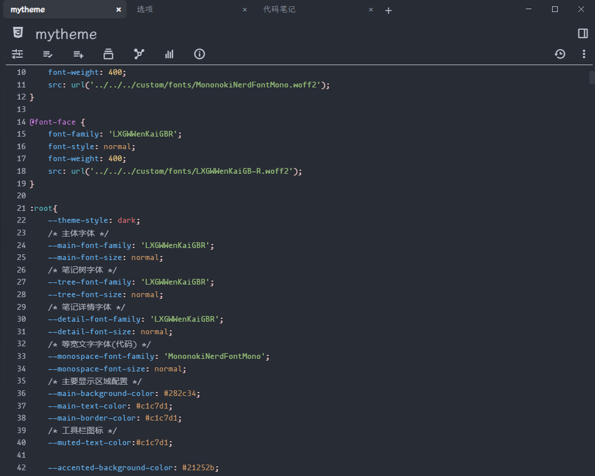
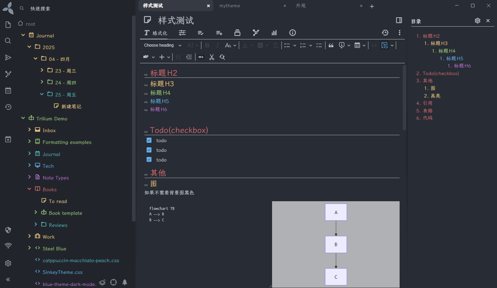
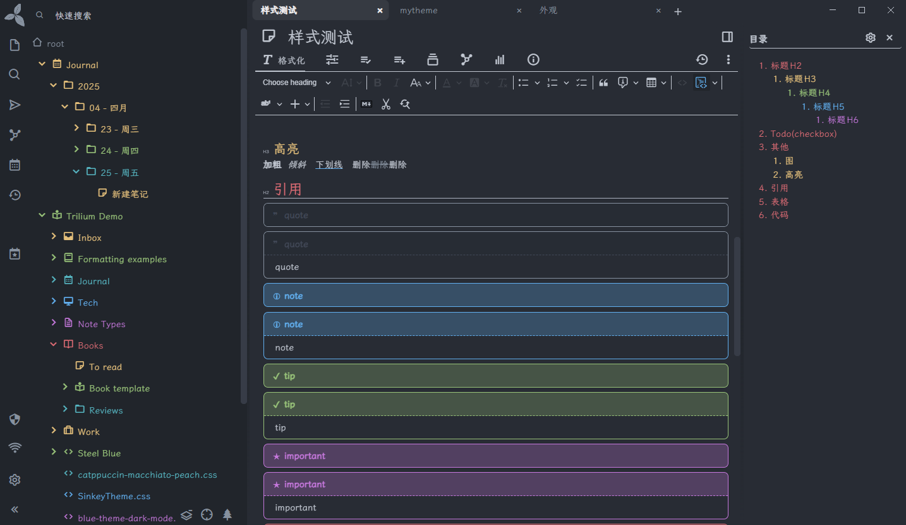
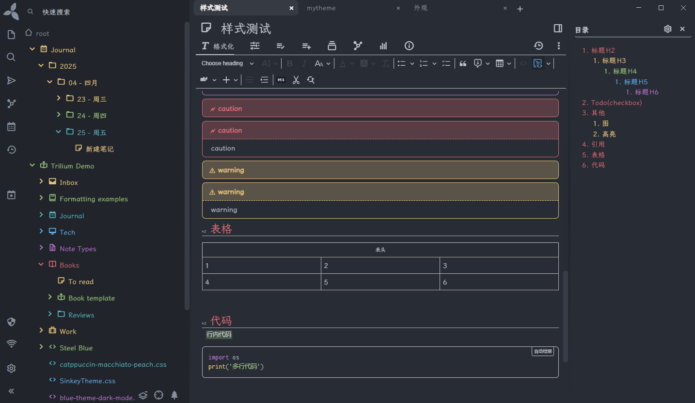

# trilium-onedark-like

source of inspiration: OneDark

If during usage you encounter that some pages appear abnormal or have significant color contrast differences, please modify the CSS in accordance with the developer tools.
如果在使用过程中遇到部分页面看起来不正常,或颜色对比度差别大,请配合开发者工具修改css

## ScreenShot
### code

### Style

